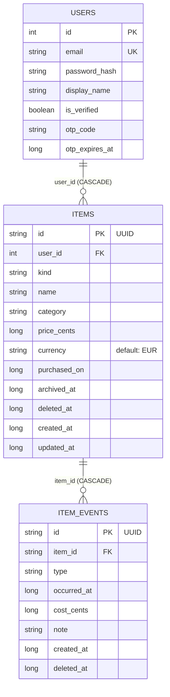

# AGENTS.md — server module

Scoped guidance for the `server` module.
Read the root [`AGENTS.md`](../AGENTS.md) first for project-wide rules.

## Purpose

`server` is the **Ktor/Netty JVM backend**. It depends on `core` for shared logic and models.
Server-only code lives here; anything shared with mobile goes in `core`.

## Package Layout

```
server/src/
  main/kotlin/dev/jakubzika/befair/
    Application.kt    ← entry point (main) + Application.module()
  test/kotlin/dev/jakubzika/befair/
    ApplicationTest.kt
```

## Entry Point & Routing

`Application.kt` contains two things:
- `fun main()` — starts the embedded Netty server on `SERVER_PORT` (from `core/Constants.kt`).
- `fun Application.module()` — installs plugins and registers routes.

Keep `module()` readable: extract large route groups into dedicated extension functions.

```kotlin
// Application.kt
fun Application.module() {
    configureRouting()
    // configureSerialization()
    // configureAuth()
}

// Routing.kt (new file, if needed)
fun Application.configureRouting() {
    routing {
        get("/") { … }
        route("/api/v1") {
            profileRoutes()
        }
    }
}
```

## Adding a Route

1. Add the route inside the appropriate `routing { }` block, or in a new `fun Application.configure<Feature>()` extension.
2. Define `@Serializable` response/request data classes in the same file or a dedicated `model/` package.
3. Install `ContentNegotiation` with `json()` if returning JSON (add `ktor-server-content-negotiation` to `gradle/libs.versions.toml` when first needed).
4. Write a `testApplication` test (see Testing section below).

## Database (Exposed + H2)

Exposed and H2 are already in `libs.versions.toml` (`exposed-core`, `exposed-jdbc`, `h2`). Add them to `server/build.gradle.kts` dependencies when needed.

Conventions when using Exposed:
- Define table objects as `object MyTable : Table("my_table") { … }` in a `db/` package.
- Create/migrate schema in `module()` via `transaction { SchemaUtils.create(MyTable) }`.
- Wrap all DB access in `transaction { … }` blocks.

### Database Schema



**Key Design Notes:**

- **users.id** auto-increments; used as FK in items and (indirectly) item_events.
- **items.id** is a client-generated UUID string (36 chars) to prevent duplicates on retried creates after flaky networks. All FKs from item_events cascade on delete.
- **item_events** uses a single table with a `type` discriminator (wear/wash/use/repair/etc.) to calculate cost-per-use and cost-per-month without per-kind counter columns on items.
- **Soft deletes:** items and item_events have `deleted_at` columns; queries should filter `WHERE deleted_at IS NULL` when appropriate.
- **Indices:** `items(user_id)` enables fast per-user queries; `item_events(item_id, occurred_at)` enables efficient cost calculations and event history lookups.

## Testing

Use `testApplication { … }` from `ktor-server-test-host`.

```kotlin
@Test
fun testMyEndpoint() = testApplication {
    application { module() }
    val response = client.get("/api/v1/my-endpoint")
    assertEquals(HttpStatusCode.OK, response.status)
}
```

```shell
# Run all server tests
./gradlew :server:test

# Run the server locally
./gradlew :server:run
# → http://0.0.0.0:8080
```

## Dependencies

Add all server dependencies via `gradle/libs.versions.toml`.
Never hard-code version strings in `server/build.gradle.kts`.
Use the `ktor-*` library aliases already defined in the version catalog.
